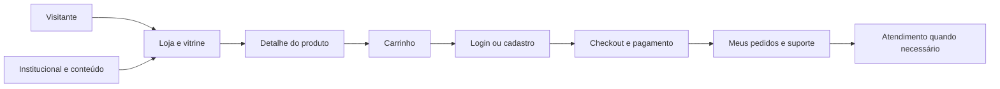

# Plataforma PetSphere — Documentação de negócios

| Campo | Valor |
|--------|--------|
| **Versão do documento** | 1.0 |
| **Data** | 25 de abril de 2026 |
| **Escopo** | Comportamento e módulos expelidos pelo **front-end** (repositório `FORMULA_PET_COM_BR` / `petsphere-com-br`, Angular 18). Regras de preço, pedidos e descontos **definitivas** residem no **backend** (API). |

> **Manutenção:** Este texto foi alinhado ao código da aplicação na data acima. Alterações de produto (novas rotas, integrações ou políticas) devem atualizar este ficheiro para evitar desinformação a stakeholders.

---

## 1. Resumo executivo

**PetSphere** é uma plataforma digital de **comércio e relacionamento** no segmento de pets: **vitrine e catálogo** com filtros avançados, **carrinho e checkout** com pagamentos (incl. Mercado Pago), **área do cliente** (pedidos, endereços, cartões, pets, favoritos), **área do veterinário** (receitas e pacientes) e um **painel administrativo** amplo para operação diária — pedidos, estoque, fórmulas, marketing (cupons, promoções, banners), vitrine (categorias, tags, temas), pessoas (clientes, veterinários, utilizadores internos), fornecedores, parceiros, pós-venda, atendimento, galeria de pets e **rastreio de atividade** na loja (com enquadramento de privacidade).

O produto assenta numa **API REST** (ex.: desdobrado em ambiente cloud; ver `src/environments/environment.ts` no repositório) e complementa a experiência com **autenticação** (Firebase no cliente) e, para utilizadores autenticados, **canal em tempo quase real** (Socket.io para eventos gerais). A marca e dados públicos de contacto (exemplo white label) estão em `src/app/constants/loja-public.ts` — ajuste copy e contactos oficiais no material comercial final.

**Proposta de valor (síntese):**

- **Para o consumidor final:** comprar produtos (incl. linhas **manipulado** e **pronto**), acompanhar pedidos, gerir entrega e pagamentos e registar **pets** e galeria.
- **Para o ecossistema clínico:** o veterinário utiliza fluxos de **receita** e **pacientes** integrados à plataforma.
- **Para a operação:** um único backoffice para **comercial, logística, marketing e suporte**, com rastreio de comportamento na loja sujeito a **opt-in** de cookies (LGPD).

---

## 2. Personas e permissões (visão de negócio)

| Persona | O que representa | Áreas de produto (referência) |
|--------|-------------------|-------------------------------|
| **Visitante** | Não autenticado | Loja pública (`/`, `/loja`), detalhe de produto, institucional, mapa, galeria pública, políticas. |
| **Cliente** | Utilizador da loja | Carrinho, checkout, meus pedidos, área do cliente, endereços, cartões, perfil, favoritos, pets, novo/editar pet, galeria. |
| **Veterinário** | Profissional com permissão `vet` | `area-vet`, gerar receita, histórico de receitas, pacientes e detalhe de paciente. |
| **Equipe interna** | Admin autenticado | `restrito/admin/*` — dashboard, pedidos, pós-venda, estoque, fórmulas, ativos, guia, vitrine, marketing, pessoas, fornecedores, parceiros, atendimento, rastreio, galeria admin, testes, etc. |
| **Parceiro comercial** | Rede alinhada à marca | Auto-cadastro (`/parceiro/cadastrar`); **gestão** no admin (listagem/estado de parceiros). |

*Nota de produto:* as **rotas** citadas correspondem a `src/app/app.routes.ts`. Nomes de ecrã podem variar ligeiramente do título do separador, mas a funcionalidade negocial mantém-se.

---

## 3. Jornada do cliente (fluxo de valor)

- **Descoberta:** home da loja, banners, categorias, tags, busca, ordenação, favoritos, destaques.
- **Consideração:** ficha de produto, preços, stock quando aplicável, promoções.
- **Conversão:** carrinho → identificação (modal global de login em vários ecrãs) → **checkout** com totais fornecidos pelo **backend** (não recalcular desconto PIX no cliente além do que a API devolve).
- **Pós-compra e retenção:** “Meus pedidos”, área do cliente, atendimento, pets e galeria, newsletter/marketing (se configurado no backoffice).

**Rastreio na loja:** o serviço de rastreio regista visitas e interações (ex. navegação, carrinho) para a equipa analisar funis no admin (**Rastreio** / atividade). O envio de analytics depende de **opt-in** às preferências de cookies; sem consentimento, identificadores de visita não são persistidos de forma reutilizável, alinhado a **LGPD**. IDs efémeros podem ainda ser usados para que login e checkout **não dependam** de analytics.

---

## 4. Módulos administrativos (o que a operação controla)

Cada linha: **objectivo de negócio** · **decisão típica**

| Módulo (rota admin) | Objectivo de negócio | Decisão típica |
|---------------------|----------------------|----------------|
| **Dashboard** (`…/dashboard`) | Visão geral operacional. | Acompanhar indicadores e entradas do dia. |
| **Meu perfil (admin)** (`…/meu-perfil-admin`) | Dados do utilizador interno. | Actualizar contacto ou credenciais. |
| **Pedidos** (`…/pedidos`) | Processar encomendas. | Alterar estado, despacho, excepções. |
| **Pós-venda / cancelamentos** (`…/pedidos-pos-venda`) | Resolver litígios e devoluções. | Cancelar, registar motivo, alinhar reembolso. |
| **Estoque** (`…/estoque`) | Disponibilidade de itens (ativos e insumos). | Ajustar quantidades, alertas. |
| **Fórmulas** (`…/formulas`) | Compostos / manipulados. | Criar ou actualizar fórmulas e regras associadas. |
| **Ativos** (`…/ativos`) | Cadastro de ativos. | Incluir ou corrigir itens de produção. |
| **Guia de ativos** (`…/guia-ativos`) | Documentação de referência interna. | Manter guia alinhado ao stock e às fórmulas. |
| **Lista de produtos** (`…/lista-produtos`) | Publicação e manutenção do catálogo. | Activar, precificar, SEO básico. |
| **Pré-visualização** (`…/produto-preview`) | Validar antes de publicar. | Aprovar layout e dados. |
| **Categorias da vitrine** (`…/marketplace/categorias`) | Navegação comercial. | Estruturar famílias de produto. |
| **Tags da vitrine** (`…/marketplace/tags`) | Filtros e campanhas. | Criar tags sazonais ou temáticas. |
| **Temas da loja** (`…/loja/temas`) | Aparência da vitrine. | Aplicar tema sazonal ou de marca. |
| **Banners** (`…/banners`) | Destaques visuais. | Programar peças e ligações. |
| **Cupons** (`…/cupons`) | Incentivos e regras de desconto. | Definir códigos, validade, limites. |
| **Promoções** (`…/promocoes`) | Inclui **percentual de desconto PIX** global. | Ajustar `P` (0–100%); 0 desliga desconto PIX. |
| **Fornecedores** (`…/fornecedores`) | Cadeia de abastecimento. | Dados e condições de fornecedores. |
| **Parceiros** (`…/parceiros`) | Rede e acordos. | Aprovar e gerir parceiros. |
| **Usuários / Clientes / Veterinários** (`…/usuarios`, `…/clientes`, `…/veterinarios`) | Gestão de acessos e perfis. | Banir, corrigir perfil, atribuir papéis. |
| **Atendimento** (`…/atendimento`) | Suporte a clientes. | Tickets ou conversas (conforme implementação). |
| **Pets / Galeria (admin)** (`…/pets-galeria`) | Conteúdo e moderação. | Aprovar media ou entradas. |
| **Rastreio** (`…/rastreio/...`) | Inteligência de utilização da loja. | Analisar eventos, funis, campanhas. |
| **Ferramentas — teste de e-mail** (`…/ferramentas/email-teste`) | Comunicação transaccional. | Validar modelos e entregas. |

---

## 5. Proposta comercial (preços, cupons, PIX e frete)

A **fonte de verdade** para totais é o **backend** (documentação de apoio no repositório: `README_CHECKOUT_DESCONTOS.md`). O marketing e a equipa comercial devem alinhar mensagens a estes princípios:

- **Subtotal (total bruto):** soma dos subtotais dos itens do pedido.
- **Cupom:** desconto calculado por um motor de elegibilidade (validade, valor mínimo, primeira compra, limites, cumulatividade com promoções — conforme regras no servidor). Respeita tetos do cupom e configuração global.
- **Frete grátis por cupom:** zera o valor do frete **sem** contar essa benesse como “desconto em linha” no total de descontos — o efeito é no frete.
- **Desconto PIX:** percentual **P** configurável em **Admin → Promoções** (armazenamento `promocoes_config.pix_discount_percent`). Aplica-se sobre a base `total_bruto - desconto_cupom` quando a forma de pagamento é PIX e P > 0. Se P = 0, não há desconto PIX, mesmo com PIX escolhido.
- **Consistência com o app:** o checkout chama a API ao mudar cupom ou forma de pagamento; o **total a pagar** deve ser o `grand_total` (ou equivalente) devolvido pela API — **não** aplicar o percentual PIX duas vezes no cliente.

*Referência de implementação (equipa técnica):* endpoints `POST/PUT` em `/checkout/pedidos` e documentação no `README_CHECKOUT_DESCONTOS.md`.

---

## 6. Canais e presença

| Canal | Descrição |
|--------|-----------|
| **Web** | Aplicação Angular com **SSR** (render no servidor) para performance e SEO. |
| **Aplicação móvel** | Projects Capacitor (iOS/Android) — o mesmo core web é empacotado para lojas de aplicações. |
| **Mapa e localização** | Página pública de mapa (`/mapa`) e ligação a morada/CEP no rodapé (constantes de identidade). |
| **Institucional** | Sobre nós, política de privacidade, módulo institucional e home alternativa. |

---

## 7. Confiança, compliance e risco de marca

- **Política de privacidade** e **página “Sobre”** reforçam transparência.
- **Cookies e preferências:** o rastreio de analytics depende de **opt-in**; sem isso, o produto evita persistência de identificadores de rastreio reutilizáveis.
- **Contas inactivas ou banidas:** o utilizador pode ver um modal global indicando indisponibilidade da conta — importante para suporte e controlo de fraude.
- **Dados de contacto e morada** em `loja-public.ts` servem de modelo; em produção, substituir pelos **dados oficiais** da marca.

---

## 8. Integrações (quadro para não técnicos)

| Integração | Papel de negócio |
|------------|------------------|
| **API REST** (`environment.apiBaseUrl`) | Catálogo, pedidos, checkout, admin, rastreio — o cérebro operacional. |
| **Firebase Authentication** | Login e identidade de utilizador no cliente; sincroniza com a lógica de sessão do produto. |
| **Backend / JWT** | Operações de loja e admin com token; o cliente armazena e reenvia o token conforme fluxo implementado. |
| **Mercado Pago (SDK JS)** | Meios de pagamento no checkout, conforme configuração de produção. |
| **Socket.io (tempo quase real)** | Ligação à mesma origem que a API, com autenticação por token. Permite a **subscrição de eventos** nomeados (ex.: actualizações operacionais). Reconexão após login ou refresh de token. |
| **Correio / notificações** | Teste de e-mail no admin; envios reais dependem de configuração do backend. |

---

## 9. Posicionamento externo e concorrência

*[Completar pelo time comercial — diferenciais frente a concorrentes, parcerias estratégicas e mensagem de marca. O código define funcionalidade, não posicionamento de mercado.]*

---

## 10. Glossário de negócio

| Termo | Significado no contexto PetSphere |
|--------|-------------------------------------|
| **Manipulado** | Produto (ex. magistral) sujeito a fórmula e regras de produção; opção de filtro no catálogo. |
| **Pronto** | Produto de prateleira; opção de filtro no catálogo. |
| **Fórmula** | Composição associada a produtos manipulados; administrada no módulo Fórmulas. |
| **Ativo / insumo** | Itens de stock ou insumos para produção; vigiados no estoque. |
| **Receita (veterinária)** | Documento/fluxo gerido pelo veterinário para paciente; área reservada com `vetGuard`. |
| **Vitrine** | Camada pública: categorias, tags, temas, banners. |
| **Pós-venda** | Cancelamentos, devoluções e excepções após a venda. |
| **Rastreio (loja)** | Eventos de navegação e interesse para análise; sujeito a consentimento. |
| **Tema da loja** | Aparência e configuração visual pública. |

---

## 11. Apêndice — rotas de produto (onboarding comercial)

Prefixo de domínio omitido. “Restrito” implica fora da jornada pública padrão.

| Caminho (path) | Nome amigável |
|----------------|---------------|
| `/`, `/loja` | Loja (vitrine) |
| `/institucional` | Institucional (módulo) |
| `/sobre-nos` | Sobre nós |
| `/politica-de-privacidade` | Política de privacidade |
| `/meus-pedidos` | Meus pedidos |
| `/mapa` | Mapa |
| `/parceiro/cadastrar` | Cadastro de parceiro |
| `/produto/:id` | Detalhe do produto |
| `/carrinho` | Carrinho |
| `/checkout` | Checkout |
| `/favoritos` | Favoritos |
| `/area-cliente` | Área do cliente |
| `/meus-enderecos` | Meus endereços |
| `/meus-cartoes` | Meus cartões |
| `/meus-pets` | Meus pets |
| `/novo-pet`, `/editar-pet/:id` | Registo / edição de pet |
| `/galeria` | Galeria pública |
| `/galeria/pet/:id` | Perfil público de pet |
| `/editar-perfil` | Editar perfil (cliente) |
| `/restrito/login` | Login (equipe / fluxo restrito) |
| `/restrito/admin/...` | Painel administrativo (vários subcaminhos; ver secção 4) |
| `/restrito/produto` | Edição de produto (admin) |
| `/area-vet` | Área do veterinário |
| `/gerar-receita` | Gerar receita |
| `/historico-receitas` | Histórico de receitas |
| `/historico-receitas/:id` | Detalhe de receita |
| `/pacientes` | Pacientes (vet) |
| `/pacientes/:petId` | Detalhe do paciente (vet) |
| `/**` (inválido) | Redirecionamento para a home da loja |

---

*Fim do documento v1.0*
